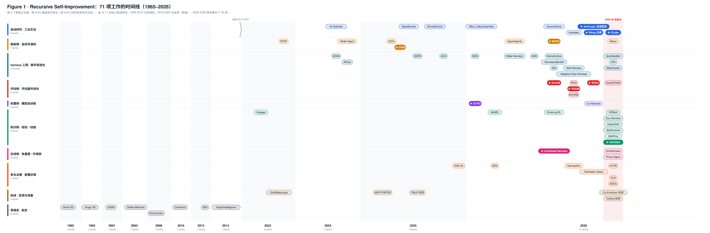
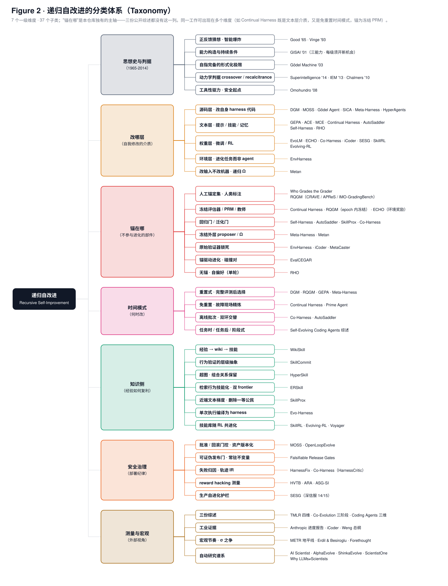

# Awesome Recursive Self-Improvement (RSI) Resources

[](https://awesome.re)




*图 1 · 71 项工作的时间线：按十个家族分泳道、按 arXiv 首版年月定位（非 arXiv 材料取发布月近似），★ 为核心精读材料；1965-2014 思想史与 2023-2026 工程爆发之间断轴，2026-08 一个月集中了 21 项。*



*图 2 · 递归自改进的分类体系：七个一级维度（思想史与判据 / 改哪层 / 锚在哪 / 时间模式 / 知识侧 / 安全治理 / 测量与宏观）、37 个子类；"锚在哪"是本仓库独有的主轴，三份公开综述都没有这一列。两图由 `scripts/make_figures.py` 生成，深色版用于 PPT。*

围绕 **Recursive Self-Improvement（递归自改进）** 的论文与资源列表 + 系统性调研仓库（2026-08-31 完成）。与一般 awesome 列表不同，本仓库同时提供：

- **29 份中文精读报告**（`reports/`，逐篇拆方法、数字、局限与谱系定位，含 00 起源前史、23 桥接史与 26/27 两份合评）
- **61 篇论文英文原版 PDF + 6 篇起源经典（1965-2013）+ 29 篇保版式中文翻译 PDF**（`papers/`，翻译由 [super_translate](https://github.com/asimfish/super_translate) 生成）
- **34 页汇总 PPT**（`report/awesome_rsi_slides.html` 方向键翻页 / `.pdf`）+ **97 页全文报告**（`report/awesome_rsi_full_report.pdf`，29 份报告合订 + 两张纵览图）

一句话结论：**执行已经自动化，品味正在被编译，锚是最后的手工业**——所有能跑的自进化系统都保留一个不参与进化的 ground-truth 锚；谁能工业化地生产不可 game 的锚，谁就握住了 RSI 的节流阀。

核心材料（本调研的十份精读对象）以 ⭐ 标记。

## Content

| [1. Start Here](#1-start-here)                          | [2. Core Readings](#2-core-readings)                          |
| ------------------------------------------------------- | ------------------------------------------------------------ |
| [2.5 Origins (1965-2014)](#25-origins-1965-2014)        | [2.6 Bridge (2023-2025)](#26-bridge-2023-2025)                |
| [3. Papers](#3-papers)                                  | [3.0 Surveys](#30-surveys)                                    |
| [3.1 Framework Side](#31-framework-side)                | [3.2 Evaluator Side](#32-evaluator-side)                      |
| [3.3 Model Side](#33-model-side)                        | [3.4 Knowledge Side](#34-knowledge-side)                      |
| [3.5 Online Side](#35-online-side)                      | [3.6 Harness & Self-Evolving Agent Lineage](#36-harness--self-evolving-agent-lineage) |
| [4. Frontier Tracking (2026 H2)](#4-frontier-tracking-2026-h2) | [4.5 Macro Debate & Measurement](#45-macro-debate--measurement) |
| [5. Ten Insights](#5-ten-insights)                      | [6. Reading Routes](#6-reading-routes)                        |
| [7. Repository Layout](#7-repository-layout)            | [8. Translation Pipeline](#8-translation-pipeline)            |
| [9. Disclaimer & Credits](#9-disclaimer--credits)       | [10. Glossary](#10-glossary)                                  |
| [11. Timeline](#11-timeline)                            | [12. Open Problems](#12-open-problems)                        |
| [13. Roadmap](#13-roadmap)                              | [14. System Comparison Matrix](#14-system-comparison-matrix)  |
| [15. Related Resources](#15-related-resources)          |                                                              |

## 1. Start Here

| 时间预算 | 路线 |
|---|---|
| 15 分钟 | 打开 [`report/awesome_rsi_slides.html`](report/awesome_rsi_slides.html)（浏览器方向键翻页，P 键打印）或 [PDF 版](report/awesome_rsi_slides.pdf)（34 页） |
| 通读 | [`report/awesome_rsi_full_report.pdf`](report/awesome_rsi_full_report.pdf)（97 页，29 份精读报告合订 + 图 1 时间线 / 图 2 分类树）· [HTML 版](report/awesome_rsi_full_report.html) |
| 2 小时 | [汇总报告](reports/10_synthesis_insights.md) → [总纲解读](reports/01_lilian_weng_harness_engineering.md) → [Who Grades the Grader 解读](reports/05_who_grades_the_grader.md)（全谱系最重要的否定性结论） |
| 系统研读 | `reports/` 按 00→23→01→02→07→03→04→05→06→08→11→09→10 顺序（谱系扩编 12-18、iCoder 19、前沿 20-22、评估器两极 24-25 按需精读），配 `papers/zh/` 中文 PDF 对照原文 |

## 2. Core Readings

总纲与工业证据（非论文类核心材料）：

1. ⭐ **Harness Engineering for Self-Improvement.** Lil'Log, 2026\. [blog](https://lilianweng.github.io/posts/2026-07-04-harness/), [解读](reports/01_lilian_weng_harness_engineering.md)
_Lilian Weng_
2. ⭐ **When AI Builds Itself: Anthropic's Progress toward Recursive Self-Improvement.** Anthropic Institute, 2026\. [article](https://www.anthropic.com/institute/recursive-self-improvement), [解读](reports/02_anthropic_when_ai_builds_itself.md)
_Anthropic_
3. **RSI 六篇论文导读帖**（本调研 3.1-3.3 节六篇论文的最初信息源）. 小红书, 2026\. [post](https://www.xiaohongshu.com/explore/6a93e8a3000000001f000d72)
4. **Continual Harness 中文解读.** 微信公众号「X0后的回忆」, 2026\. [article](https://mp.weixin.qq.com/s/xMuLJvX3kwRUUw5WQ7R3ww)
5. **Harness 自进化全景：三种范式与六个系统的实现思路**（Self-Harness / Meta-Harness / AutoSaddler / EnvHarness / Prime Agent / MetaCaster 六系统导读）. 微信公众号, 2026\. [article](https://mp.weixin.qq.com/s/Lm_hmnkeeWlN6zVGlBBphw)
6. **Agentic RL 系列（上）：环境、轨迹、Reward 与训练闭环.** 微信公众号, 2026\. [article](https://mp.weixin.qq.com/s/Ly2BvP3y2bFB9czGqRguWQ)
7. **Agentic RL 系列（中）：SkillRL，如何把一次失败变成可复用的 Skill.** 微信公众号, 2026\. [article](https://mp.weixin.qq.com/s/wqMM1D4NZQmRtWOcebuhTA)
8. **Agentic RL 系列（下）：Evolving-RL，用 Reward 训练 Agent 总结经验.** 微信公众号, 2026\. [article](https://mp.weixin.qq.com/s/bu3-RyqaYPdA1mH79oF39g)
9. **AI到底能不能自己造AI？别吵了，有人做出来了**（iCoder 中文解读）. 微信公众号, 2026\. [article](https://mp.weixin.qq.com/s/28q7O59IzEXl_tiWulYbDA)
10. **一篇 Self-Evolving Coding Agents 最新综述**（arXiv 2608.03392 中文解读）. 微信公众号, 2026\. [article](https://mp.weixin.qq.com/s/hSrJLcZN3j7J7X02N2HIMg)

## 2.5 Origins (1965-2014)

RSI 概念的思想起源四篇（逐篇拆解见[解读报告 00](reports/00_origins_1965_2014.md)）：Good 给正反馈直觉，Yudkowsky 给能力构造与持续条件，Schmidhuber 给自指完备的形式化极限，Bostrom 给进入强 RSI 的动力学判据（crossover）。

1. ⭐ **Speculations Concerning the First Ultraintelligent Machine.** Advances in Computers Vol. 6, 1965\. [paper](http://incompleteideas.net/papers/Good65ultraintelligent.pdf), [PDF](papers/classics/1965_Good_UltraintelligentMachine.pdf)（扫描影印版，无文本层）, [解读](reports/00_origins_1965_2014.md)
_Irving John Good_ — 提出 intelligence explosion："设计机器本身也是一种智力活动，超智能机器可以设计出更好的机器"，智能提升提高产生进一步提升的能力，形成正反馈。
2. ⭐ **General Intelligence and Seed AI 2.3.** Singularity Institute, 2000-2001\. [web archive](https://web.archive.org/web/20120805130100/singularity.org/files/GISAI.html), [PDF](papers/classics/2001_Yudkowsky_GISAI.pdf), [PDF-zh](papers/classics/2001_Yudkowsky_GISAI_zh.pdf), [解读](reports/00_origins_1965_2014.md)
_Eliezer Yudkowsky_ — 描述具备 self-understanding / self-modification / recursive self-improvement 的 Seed AI；指出让固定优化器跑得更快不能维持递归改进，每一级提升必须让系统看到或实现新的改进机会。
3. ⭐ **Gödel Machines: Self-Referential Universal Problem Solvers Making Provably Optimal Self-Improvements.** arXiv, 2003\. [paper](https://arxiv.org/abs/cs/0309048), [PDF](papers/classics/2003_Schmidhuber_GoedelMachines.pdf), [PDF-zh](papers/classics/2003_Schmidhuber_GoedelMachines_zh.pdf), [解读](reports/00_origins_1965_2014.md)
_Juergen Schmidhuber_ — 寻找 improvement 的机制本身也在可修改集合里；proof searcher 找到"自改写收益可证明更高"的证明才执行改写。
4. ⭐ **Superintelligence: Paths, Dangers, Strategies.** Oxford University Press, 2014\. [book](https://global.oup.com/academic/product/superintelligence-9780199678112), [解读](reports/00_origins_1965_2014.md)
_Nick Bostrom_ — 把 RSI 放入 optimization power / recalcitrance 动力学；crossover point：系统自身贡献开始主导后续改进即进入 strong RSI。判据："When the AI improves itself, it improves the thing that does the improving"——一次改进是否同时提升发现、验证、实现下一次改进的能力。

同期扩展阅读（未单独精读，供补全思想史）：

5. **The Coming Technological Singularity: How to Survive in the Post-Human Era.** VISION-21 Symposium, 1993\. [essay](https://edoras.sdsu.edu/~vinge/misc/singularity.html)
_Vernor Vinge_ — 把 Good 的智能爆炸命名为"奇点"并给出四条路径，第一条即"足够觉醒的超人智能计算机"。
6. **The Basic AI Drives.** AGI-08, 2008\. [paper](https://selfawaresystems.com/wp-content/uploads/2008/01/ai_drives_final.pdf), [PDF](papers/classics/2008_Omohundro_BasicAIDrives.pdf)
_Stephen M. Omohundro_ — 论证任何足够强的目标驱动系统都会自发产生自改进、自保护、资源获取等工具性驱力——RSI 安全讨论的起点。
7. **The Singularity: A Philosophical Analysis.** Journal of Consciousness Studies, 2010\. [paper](http://consc.net/papers/singularity.pdf), [PDF](papers/classics/2010_Chalmers_Singularity.pdf)
_David J. Chalmers_ — 把智能爆炸论证形式化为"比例论题 + 扩展论题"，并系统讨论结构性障碍与动机性障碍。
8. **Intelligence Explosion Microeconomics.** MIRI Technical Report, 2013\. [paper](https://intelligence.org/files/IEM.pdf), [PDF](papers/classics/2013_Yudkowsky_IEM.pdf)
_Eliezer Yudkowsky_ — 把"认知再投资的回报率"作为核心变量，讨论 recalcitrance 曲线形状；Bostrom 2014 动力学框架的直接前身，也是报告 10 insight 9（σ 替代弹性）宏观争论的源头。

## 2.6 Bridge (2023-2025)

从思想史到 2025 年工程爆发之间的四块踏脚石（逐篇拆解见[解读报告 23](reports/23_godel_agent_to_sica.md)，其中 Gödel Agent 与 SICA 为精读对象）：

1. **Voyager: An Open-Ended Embodied Agent with Large Language Models.** arXiv, 2023\. [paper](https://arxiv.org/abs/2305.16291), [code](https://github.com/MineDojo/Voyager), [PDF-en](papers/en/2305.16291_Voyager.pdf)
_Guanzhi Wang, Yuqi Xie, Yunfan Jiang, Ajay Mandlekar, et al. (NVIDIA/Caltech/Stanford)_ — 第一个"可执行技能库随交互增长"的 LLM agent，WikiSkill / SkillRL 等知识侧工作的共同祖先。
2. **The AI Scientist: Towards Fully Automated Open-Ended Scientific Discovery.** arXiv, 2024\. [paper](https://arxiv.org/abs/2408.06292), [code](https://github.com/SakanaAI/AI-Scientist), [PDF-en](papers/en/2408.06292_AIScientist.pdf)
_Chris Lu, Cong Lu, Robert Tjarko Lange, Jakob Foerster, Jeff Clune, David Ha (Sakana AI)_ — Weng 博文"auto-research"线的起点：端到端自动生成 ML 论文，也暴露了 Why LLMs Aren't Scientists Yet 后来系统化的失败模式。
3. ⭐ **Gödel Agent: A Self-Referential Agent Framework for Recursively Self-Improvement.** arXiv, 2024\. [paper](https://arxiv.org/abs/2410.04444), [code](https://github.com/Arvid-pku/Godel_Agent), [PDF-en](papers/en/2410.04444_GodelAgent.pdf), [PDF-zh](papers/zh/2410.04444_GodelAgent_zh.pdf), [解读](reports/23_godel_agent_to_sica.md)
_Xunjian Yin, Xinyi Wang, Liangming Pan, Li Lin, Xiaojun Wan, William Yang Wang (PKU/UCSB)_ — Gödel Machine 的第一个 LLM 实现：monkey patching 运行时改写自身逻辑，只靠高层目标提示驱动。
4. ⭐ **A Self-Improving Coding Agent (SICA).** arXiv, 2025\. [paper](https://arxiv.org/abs/2504.15228), [code](https://github.com/MaximeRobeyns/self_improving_coding_agent), [PDF-en](papers/en/2504.15228_SICA.pdf), [PDF-zh](papers/zh/2504.15228_SICA_zh.pdf), [解读](reports/23_godel_agent_to_sica.md)
_Maxime Robeyns, Martin Szummer, Laurence Aitchison (Bristol/iGent AI)_ — SWE-Bench Verified 子集 17%→53%；显式多目标效用函数 + 版本档案 + 异步监督者——自改写系统安全部件的起点。

## 3. Papers

> 分类沿用本调研的五侧地图：**框架侧**（改 harness 源码）、**评估侧**（评估器共进化）、**模型侧**（critic 与权重）、**知识侧**（经验编译为技能）、**在线侧**（免重置在线适应）。每条提供 arXiv 链接、仓库内英文/中文 PDF 与精读报告的相对链接。

### 3.0 Surveys

1. **A Survey of Self-Evolving Agents: What, When, How, and Where to Evolve on the Path to Artificial Super Intelligence.** TMLR, 2026\. [paper](https://arxiv.org/abs/2507.21046), [PDF-en](papers/en/2507.21046_SelfEvolvingAgentsSurvey.pdf), [PDF-zh](papers/zh/2507.21046_SelfEvolvingAgentsSurvey_zh.pdf), [解读](reports/12_self_evolving_agents_survey.md)
_Huan-ang Gao, Jiayi Geng, Wenyue Hua, Mengkang Hu, Xinzhe Juan, Hongzhang Liu, Shilong Liu, Jiahao Qiu, et al._

2. ⭐ **Co-Evolution in Agentic Systems: Toward Self-Directed Evolution Beyond Human Design.** arXiv, 2026\. [paper](https://arxiv.org/abs/2608.10299), [PDF-en](papers/en/2608.10299_CoEvolutionSurvey.pdf), [PDF-zh](papers/zh/2608.10299_CoEvolutionSurvey_zh.pdf), [解读](reports/22_coevolution_survey.md)
_Qing Zong, Jiayu Liu, Junhao Shen, Zecong Tang, Linsi Wu, et al., Yangqiu Song (HKUST/UIUC/CUHK/HKU/PKU)_ — 三阶段递进分类（Agent-Agent → Agent-Environment → Meta 共进化），本调研评估侧四篇的统一坐标。
3. ⭐ **Self-Evolving Coding Agents.** arXiv, 2026\. [paper](https://arxiv.org/abs/2608.03392), [awesome list](https://github.com/iSEngLab/Awesome-Self-Evolving-Coding-Agents), [PDF-en](papers/en/2608.03392_SelfEvolvingCodingAgentsSurvey.pdf), [PDF-zh](papers/zh/2608.03392_SelfEvolvingCodingAgentsSurvey_zh.pdf), [解读](reports/28_self_evolving_coding_agents_survey.md), [中文解读](https://mp.weixin.qq.com/s/hSrJLcZN3j7J7X02N2HIMg)
_Hao Zhou, Haichuan Hu, Ye Shang, Quanjun Zhang (NJUST/NJU, iSEngLab)_ — 编码域垂直综述：进化对象六类 × 进化时间三类（任务时 / 任务后 / 阶段式）× 进化证据三类（结果 / 环境 / 轨迹）；核心警告——不可靠的测试或基准捷径会被存进记忆、蒸馏成技能、更新进模型，错误被持久化。

三份综述的分工：报告 12 给单体自进化四维坐标，报告 22 给多组件共进化三阶段，报告 28 给编码域对象-时间-证据三维——本仓库每篇论文都能在至少两张图里找到位置。

### 3.1 Framework Side

> 自改进的工程化基线与生产部署：agent 直接改写自己的 harness 代码库。

1. ⭐ **Darwin Gödel Machine: Open-Ended Evolution of Self-Improving Agents.** ICLR, 2026\. [paper](https://arxiv.org/abs/2505.22954), [code](https://github.com/jennyzzt/dgm), [PDF-en](papers/en/2505.22954_DGM.pdf), [PDF-zh](papers/zh/2505.22954_DGM_zh.pdf), [解读](reports/07_darwin_godel_machine.md)
_Jenny Zhang, Shengran Hu, Cong Lu, Robert Lange, Jeff Clune_
2. ⭐ **MOSS: Self-Evolution through Source-Level Rewriting in Autonomous Agent Systems.** arXiv, 2026\. [paper](https://arxiv.org/abs/2605.22794), [PDF-en](papers/en/2605.22794_MOSS.pdf), [PDF-zh](papers/zh/2605.22794_MOSS_zh.pdf), [解读](reports/08_moss.md)
_Qianshu Cai, Yonggang Zhang, Xianzhang Jia, Huajiang Zheng, Wei Xue, Jun Song, Xinmei Tian, Yike Guo_

### 3.2 Evaluator Side

> 评估器不再是固定裁判：rubric 共进化、受控效用进化、锚定纪律——以及"评估器塌缩与真进化观测等价"的否定性结论。

1. ⭐ **EvoLM: Self-Evolving Language Models through Co-Evolved Discriminative Rubrics.** arXiv, 2026\. [paper](https://arxiv.org/abs/2605.03871), [code](https://github.com/stellalisy/EvoLM), [PDF-en](papers/en/2605.03871_EvoLM.pdf), [PDF-zh](papers/zh/2605.03871_EvoLM_zh.pdf), [解读](reports/03_evolm.md)
_Shuyue Stella Li, Rui Xin, Teng Xiao, Yike Wang, Rulin Shao, Zoey Hao, Melanie Sclar, Sewoong Oh, Faeze Brahman, Pang Wei Koh, Yulia Tsvetkov_
2. ⭐ **The Red Queen Gödel Machine: Co-Evolving Agents and Their Evaluators.** arXiv, 2026\. [paper](https://arxiv.org/abs/2606.26294), [PDF-en](papers/en/2606.26294_RQGM.pdf), [PDF-zh](papers/zh/2606.26294_RQGM_zh.pdf), [解读](reports/04_red_queen_godel_machine.md)
_Alex Iacob, Andrej Jovanović, William F. Shen, Daniel Burkhardt, Meghdad Kurmanji, et al._
3. ⭐ **Who Grades the Grader? Co-Evolving Evaluation Metrics and Skills for Self-Improving LLM Agents.** arXiv, 2026\. [paper](https://arxiv.org/abs/2607.12790), [PDF-en](papers/en/2607.12790_WhoGradesTheGrader.pdf), [PDF-zh](papers/zh/2607.12790_WhoGradesTheGrader_zh.pdf), [解读](reports/05_who_grades_the_grader.md)
_Xing Zhang, Guanghui Wang, Yanwei Cui, Ziyuan Li, Wei Qiu, Bing Zhu, Peiyang He_

### 3.3 Model Side

> 把共进化推进到权重层：critic 与 policy 双路同步更新，解决 critic 滞后于 policy 分布偏移。

1. ⭐ **No More Stale Feedback: Co-Evolving Critics for Open-World Agent Learning (ECHO).** arXiv, 2026\. [paper](https://arxiv.org/abs/2601.06794), [PDF-en](papers/en/2601.06794_ECHO.pdf), [PDF-zh](papers/zh/2601.06794_ECHO_zh.pdf), [解读](reports/06_echo.md)
_Zhicong Li, Lingjie Jiang, Yulan Hu, Xingchen Zeng, Yixia Li, Xiangwen Zhang, Guanhua Chen, Zheng Pan, Xin Li, Yong Liu_

### 3.4 Knowledge Side

> 经验必须先编译成结构化知识（wiki）再蒸馏为技能，才能跨任务复利。

1. ⭐ **WikiSkill: Compiling Agent Experience into Persistent Knowledge for Skill Evolution.** arXiv, 2026\. [paper](https://arxiv.org/abs/2608.27454), [PDF-en](papers/en/2608.27454_WikiSkill.pdf), [PDF-zh](papers/zh/2608.27454_WikiSkill_zh.pdf), [解读](reports/09_wikiskill.md)
_Liyan Tang, Cyrus Rashtchian, Chun-Sung Ferng, Andrew Tomkins, Da-Cheng Juan, Tu Vu_
2. **SkillRL: Evolving Agents via Recursive Skill-Augmented Reinforcement Learning.** arXiv, 2026\. [paper](https://arxiv.org/abs/2602.08234), [code](https://github.com/aiming-lab/SkillRL), [PDF-en](papers/en/2602.08234_SkillRL.pdf), [中文解读](https://mp.weixin.qq.com/s/wqMM1D4NZQmRtWOcebuhTA)
_Peng Xia, Jianwen Chen, Hanyang Wang, Jiaqi Liu, et al. (UNC/aiming-lab)_ — 轨迹蒸馏为分层 SkillBank，技能库在 RL 中按验证失败递归进化，ALFWorld/WebShop 超基线 15.3%。
3. **Evolving-RL: End-to-End Optimization of Experience-Driven Self-Evolving Capability within Agents.** arXiv, 2026\. [paper](https://arxiv.org/abs/2605.10663), [code](https://github.com/Fanzy27/Evolving-RL), [PDF-en](papers/en/2605.10663_EvolvingRL.pdf), [中文解读](https://mp.weixin.qq.com/s/bu3-RyqaYPdA1mH79oF39g)
_Xiaohongshu Inc. + Peking University_ — 同一共享策略同时当 extractor 与 solver，用下游迁移收益做 GRPO 奖励联合优化经验提取与利用；ALFWorld 未见任务相对 GRPO 基线 +98.7%。

### 3.5 Online Side

> 免重置（reset-free）在线自改进：在故障现场修 harness 而非回起点重来，并首次闭环模型-harness 共学习。

1. ⭐ **Continual Harness: Online Adaptation for Self-Improving Foundation Agents.** arXiv, 2026\. [paper](https://arxiv.org/abs/2605.09998), [project](https://sethkarten.ai/continual-harness), [PDF-en](papers/en/2605.09998_ContinualHarness.pdf), [PDF-zh](papers/zh/2605.09998_ContinualHarness_zh.pdf), [解读](reports/11_continual_harness.md)
_Seth Karten, Joel Zhang, Tersoo Upaa Jr, Ruirong Feng, Wenzhe Li, Chengshuai Shi, Chi Jin, Kiran Vodrahalli_

### 3.6 Harness & Self-Evolving Agent Lineage

> Weng 博文谱系与本调研扩展收录的自进化 agent 前置/平行工作，按时间排序。其中 Self-Harness / Meta-Harness / AutoSaddler / EnvHarness / Prime Agent / MetaCaster 六个系统的中文导读见 [Harness 自进化全景](https://mp.weixin.qq.com/s/Lm_hmnkeeWlN6zVGlBBphw)。

1. **Self-Taught Optimizer (STOP): Recursively Self-Improving Code Generation.** COLM, 2024\. [paper](https://arxiv.org/abs/2310.02304), [PDF-en](papers/en/2310.02304_STOP.pdf), [PDF-zh](papers/zh/2310.02304_STOP_zh.pdf)
_Eric Zelikman, Eliana Lorch, Lester Mackey, Adam Tauman Kalai_
2. **Automated Design of Agentic Systems (ADAS).** ICLR, 2025\. [paper](https://arxiv.org/abs/2408.08435), [code](https://github.com/ShengranHu/ADAS), [PDF-en](papers/en/2408.08435_ADAS.pdf)
_Shengran Hu, Cong Lu, Jeff Clune_
3. **AFlow: Automating Agentic Workflow Generation.** ICLR, 2025\. [paper](https://arxiv.org/abs/2410.10762), [code](https://github.com/FoundationAgents/AFlow), [PDF-en](papers/en/2410.10762_AFlow.pdf)
_Jiayi Zhang, Jinyu Xiang, Zhaoyang Yu, Fengwei Teng, Xiong-Hui Chen, et al._
4. **AlphaEvolve: A Coding Agent for Scientific and Algorithmic Discovery.** arXiv, 2025\. [paper](https://arxiv.org/abs/2506.13131), [PDF-en](papers/en/2506.13131_AlphaEvolve.pdf)
_Alexander Novikov, Ngân Vũ, Marvin Eisenberger, Emilien Dupont, Po-Sen Huang, et al. (Google DeepMind)_
5. **GEPA: Reflective Prompt Evolution Can Outperform Reinforcement Learning.** ICLR (Oral), 2026\. [paper](https://arxiv.org/abs/2507.19457), [code](https://github.com/gepa-ai/gepa), [PDF-en](papers/en/2507.19457_GEPA.pdf)
_Lakshya A Agrawal, Shangyin Tan, Dilara Soylu, Noah Ziems, et al._
6. **ShinkaEvolve: Towards Open-Ended and Sample-Efficient Program Evolution.** arXiv, 2025\. [paper](https://arxiv.org/abs/2509.19349), [code](https://github.com/SakanaAI/ShinkaEvolve), [PDF-en](papers/en/2509.19349_ShinkaEvolve.pdf)
_Robert Tjarko Lange, Yuki Imajuku, Edoardo Cetin (Sakana AI)_
7. **Agentic Context Engineering (ACE): Evolving Contexts for Self-Improving Language Models.** ICLR, 2026\. [paper](https://arxiv.org/abs/2510.04618), [PDF-en](papers/en/2510.04618_ACE.pdf), [PDF-zh](papers/zh/2510.04618_ACE_zh.pdf)
_Qizheng Zhang, Changran Hu, Shubhangi Upasani, Boyuan Ma, et al._
8. **Why LLMs Aren't Scientists Yet: Lessons from Four Autonomous Research Attempts.** arXiv, 2026\. [paper](https://arxiv.org/abs/2601.03315), [PDF-en](papers/en/2601.03315_WhyLLMsArentScientistsYet.pdf)
_Dhruv Trehan, Paras Chopra_
9. **Meta Context Engineering via Agentic Skill Evolution (MCE).** arXiv, 2026\. [paper](https://arxiv.org/abs/2601.21557), [PDF-en](papers/en/2601.21557_MCE.pdf), [PDF-zh](papers/zh/2601.21557_MCE_zh.pdf)
_Haoran Ye, Xuning He, Vincent Arak, Haonan Dong, Guojie Song_
10. **HyperAgents.** arXiv, 2026\. [paper](https://arxiv.org/abs/2603.19461), [PDF-en](papers/en/2603.19461_Hyperagents.pdf)
_Jenny Zhang, Bingchen Zhao, Wannan Yang, Jakob Foerster, Jeff Clune, Minqi Jiang, Sam Devlin, Tatiana Shavrina_
11. **Meta-Harness: End-to-End Optimization of Model Harnesses.** arXiv, 2026\. [paper](https://arxiv.org/abs/2603.28052), [code](https://github.com/stanford-iris-lab/meta-harness-tbench2-artifact), [PDF-en](papers/en/2603.28052_MetaHarness.pdf), [PDF-zh](papers/zh/2603.28052_MetaHarness_zh.pdf), [解读](reports/13_meta_harness.md)
_Yoonho Lee, Roshen Nair, Qizheng Zhang, Kangwook Lee, et al._
12. **Agentic Harness Engineering: Observability-Driven Automatic Evolution of Coding-Agent Harnesses (AHE).** arXiv, 2026\. [paper](https://arxiv.org/abs/2604.25850), [code](https://github.com/china-qijizhifeng/agentic-harness-engineering), [PDF-en](papers/en/2604.25850_AHE.pdf), [PDF-zh](papers/zh/2604.25850_AHE_zh.pdf)
_Jiahang Lin, Shichun Liu, Chengjun Pan, Lizhi Lin, Shihan Dou, et al._
13. **DemoEvolve: Overcoming Sparse Feedback in Agentic Harness Evolution with Demonstrations.** arXiv, 2026\. [paper](https://arxiv.org/abs/2605.24539), [PDF-en](papers/en/2605.24539_DemoEvolve.pdf)
_Lirong Che, Yuzhe Yang, Peiwen Lin, Chuang Wang, Xueqian Wang, Jian Su_
14. **ScientistOne: Towards Human-Level Autonomous Research via Chain-of-Evidence.** arXiv, 2026\. [paper](https://arxiv.org/abs/2605.26340), [PDF-en](papers/en/2605.26340_ScientistOne.pdf)
_Rui Meng, Bhavana Dalvi Mishra, Jiefeng Chen, Chun-Liang Li, et al. (Google Cloud AI Research)_
15. **SIA: Self Improving AI with Harness & Weight Updates.** arXiv, 2026\. [paper](https://arxiv.org/abs/2605.27276), [PDF-en](papers/en/2605.27276_SIA.pdf)
_Prannay Hebbar, Yogendra Manawat, Samuel Verboomen, et al. (Hexo Labs)_
16. **Harness Updating Is Not Harness Benefit: Disentangling Evolution Capabilities in Self-Evolving LLM Agents.** arXiv, 2026\. [paper](https://arxiv.org/abs/2605.30621), [PDF-en](papers/en/2605.30621_HarnessUpdatingNotBenefit.pdf)
_Minhua Lin, Juncheng Wu, Zijun Wang, Zhan Shi, Yisi Sang, et al._
17. **Self-Harness: Harnesses That Improve Themselves.** arXiv, 2026\. [paper](https://arxiv.org/abs/2606.09498), [PDF-en](papers/en/2606.09498_SelfHarness.pdf), [PDF-zh](papers/zh/2606.09498_SelfHarness_zh.pdf), [解读](reports/14_self_harness.md)
_Hangfan Zhang, Shao Zhang, Kangcong Li, Chen Zhang, Yang Chen, Yiqun Zhang, Lei Bai, Shuyue Hu_
18. **Autodata: An Agentic Data Scientist to Create High Quality Synthetic Data.** arXiv, 2026\. [paper](https://arxiv.org/abs/2606.25996), [PDF-en](papers/en/2606.25996_Autodata.pdf)
_Ilia Kulikov, Chenxi Whitehouse, Tianhao Wu, Yixin Nie, et al. (FAIR at Meta)_
23. ⭐ **iCoder: Recursive AI-Led Development of Frontier Industrial Coding Model.** Tech Report, 2026\. [report](https://huggingface.co/i-Coder/iCoder-27B/blob/main/Coder_Tech_Report.pdf), [code](https://github.com/bingreeky/iCoder), [model](https://huggingface.co/i-Coder/iCoder-27B), [PDF-en](papers/en/iCoder27B_TechReport.pdf), [PDF-zh](papers/zh/iCoder27B_TechReport_zh.pdf), [解读](reports/19_icoder.md)
_Cheng Yang, Jiayang Lyu, Shangyuan Liu, Guibin Zhang, et al. (SJTU, NUS, DP Technology)_ — AI 主导交付 release-ready 27B 工业编码模型（RTLLM 68.0 超 GPT-5.5/Opus 4.8），人类介入压缩为"高密度 prior、低频门控"五层接口。**本仓库计划以其代码库为后续开发基础。**
19. **EnvHarness: Awakening Static Worlds for Agent Learning.** arXiv, 2026\. [paper](https://arxiv.org/abs/2608.19880), [PDF-en](papers/en/2608.19880_EnvHarness.pdf), [PDF-zh](papers/zh/2608.19880_EnvHarness_zh.pdf), [解读](reports/15_envharness.md)
_Chengsong Huang, Zifeng Wang, Rujun Han, Jun Yan, Yanfei Chen, et al. (Google Cloud AI Research)_
20. **AutoSaddler: Automatic Harness Optimization with Durable Updates from Agent Execution Traces.** arXiv, 2026\. [paper](https://arxiv.org/abs/2608.23041), [PDF-en](papers/en/2608.23041_AutoSaddler.pdf), [PDF-zh](papers/zh/2608.23041_AutoSaddler_zh.pdf), [解读](reports/16_autosaddler.md)
_Sungho Park, Wonjoong Kim, Rongyuan Tan, Jue Zhang, Wook-Shin Han, et al. (POSTECH, KAIST, SUSTech, Microsoft)_
21. **MetaCaster: Meta-Harness-Optimized Agent for End-to-End Few-Shot Learning of Lightweight Time Series Forecasters.** arXiv, 2026\. [paper](https://arxiv.org/abs/2608.23473), [code](https://github.com/D2I-Group/metacaster), [PDF-en](papers/en/2608.23473_MetaCaster.pdf), [PDF-zh](papers/zh/2608.23473_MetaCaster_zh.pdf), [解读](reports/17_metacaster.md)
_ChengAo Shen, Wenchao Yu, Fangyu Wu, Dongjin Song, Hanghang Tong, et al. (UH, NEC Labs)_
22. **Prime Agent: A Self-Improving RLM Harness.** arXiv, 2026\. [paper](https://arxiv.org/abs/2608.23552), [code](https://github.com/PrimeIntellect-ai/prime-agent), [PDF-en](papers/en/2608.23552_PrimeAgent.pdf), [PDF-zh](papers/zh/2608.23552_PrimeAgent_zh.pdf), [解读](reports/18_prime_agent.md)
_Seth Karten, Alex L. Zhang, Kevin Thomas, Sebastian Müller, et al. (Princeton, Prime Intellect, MIT)_

## 4. Frontier Tracking (2026 H2)

2026 年 6-8 月扫描结果（完整笔记见 [`assets/trends_research_raw.md`](assets/trends_research_raw.md)：19 篇新论文 + 9 项工业动态 + 7 项基准动态 + 8 项安全治理）。全部 20 篇英文 PDF 已入库；Metan / Co-Harness / 共进化综述 / EvalCEGAR 四篇附中文翻译；Metan / Co-Harness / 共进化综述 / EvalCEGAR / RHO 有精读报告（20 / 21 / 22 / 24 / 25，其中 24-25 构成"锚 vs 无锚"对照组）；技能红海五篇与安全治理五篇各有一份合评（26 / 27）。

**评估器军备赛**

1. **EvalCEGAR: Metrics That Write Themselves.** [arXiv:2608.18744](https://arxiv.org/abs/2608.18744), [PDF-en](papers/en/2608.18744_EvalCEGAR.pdf), [PDF-zh](papers/zh/2608.18744_EvalCEGAR_zh.pdf), [解读](reports/24_evalcegar.md) — 用反例（而非 prompt）驱动评估器算子进化，延续 Who Grades the Grader 路线。
2. **SCORE: Self-Evolving Deep Research via Joint Generation and Evaluation.** [arXiv:2606.04507](https://arxiv.org/abs/2606.04507), [PDF-en](papers/en/2606.04507_SCORE.pdf) — 评估器与求解器共享参数联合训练，推进到权重层。
3. **Co-Evolution in Agentic Systems (Survey).** [arXiv:2608.10299](https://arxiv.org/abs/2608.10299), [PDF-en](papers/en/2608.10299_CoEvolutionSurvey.pdf), [PDF-zh](papers/zh/2608.10299_CoEvolutionSurvey_zh.pdf), [解读](reports/22_coevolution_survey.md) — 首个以共进化为中心轴的综述：Agent-Agent / Agent-Environment / Meta 三层。

**技能进化红海（WikiSkill 同月平行工作）**

4. **SkillCommit.** [arXiv:2608.15165](https://arxiv.org/abs/2608.15165), [PDF-en](papers/en/2608.15165_SkillCommit.pdf), [合评](reports/26_skill_evolution_wave.md) — 反对语义相似度合并，用行为验证的层级抽象提交。
5. **HyperSkill.** [arXiv:2608.16114](https://arxiv.org/abs/2608.16114), [PDF-en](papers/en/2608.16114_HyperSkill.pdf), [合评](reports/26_skill_evolution_wave.md) — 超图结构技能记忆，GAIA +11.5。
6. **ERSkill.** [arXiv:2608.12720](https://arxiv.org/abs/2608.12720), [PDF-en](papers/en/2608.12720_ERSkill.pdf), [合评](reports/26_skill_evolution_wave.md) — 检索行为本身技能化，双 frontier 解耦扩张与部署。
7. **SkillProx.** [arXiv:2608.07449](https://arxiv.org/abs/2608.07449), [PDF-en](papers/en/2608.07449_SkillProx.pdf), [合评](reports/26_skill_evolution_wave.md) — 近端梯度下降形式化搬到文本技能空间，删除是一等公民。
8. **Evo-Harness.** [arXiv:2608.15071](https://arxiv.org/abs/2608.15071), [PDF-en](papers/en/2608.15071_EvoHarness.pdf), [合评](reports/26_skill_evolution_wave.md) — 反思编译为技能 harness，五基准系统性隔离变量。

**Harness 工程化与共学习**

9. **Co-Harness: Co-Evolving Harnesses and Model Weights.** [arXiv:2607.22688](https://arxiv.org/abs/2607.22688), [PDF-en](papers/en/2607.22688_CoHarness.pdf), [PDF-zh](papers/zh/2607.22688_CoHarness_zh.pdf), [解读](reports/21_co_harness.md) — harness 优化产生轨迹再蒸馏进权重，双环交替。
10. **RHO: Retrospective Harness Optimization via Self-Preference.** [arXiv:2606.05922](https://arxiv.org/abs/2606.05922), [PDF-en](papers/en/2606.05922_RHO.pdf), [解读](reports/25_rho.md) — 完全无标签自优化，SWE-Bench Pro 59%→78%。
11. **Adaptive Auto-Harness.** [arXiv:2606.01770](https://arxiv.org/abs/2606.01770), [PDF-en](papers/en/2606.01770_AdaptiveAutoHarness.pdf) — 密集自改进在开放任务流上早峰后衰减的负结果实证。
12. **HarnessFix.** [arXiv:2606.06324](https://arxiv.org/abs/2606.06324), [PDF-en](papers/en/2606.06324_HarnessFix.pdf), [合评](reports/27_safety_governance.md) — 轨迹+harness 编译为 IR，失败归因到 ETCLOVG 七层。
13. **Metan (Meta^n): RSI through Emergent Depth.** [arXiv:2608.24735](https://arxiv.org/abs/2608.24735), [PDF-en](papers/en/2608.24735_Metan.pdf), [PDF-zh](papers/zh/2608.24735_Metan_zh.pdf), [解读](reports/20_metan.md) — 论证自改写 meta 深度上限约 2.5，改输入不改机器绕开权衡。
14. **HSI: Hierarchical Self-Improvement.** [arXiv:2608.08466](https://arxiv.org/abs/2608.08466), [PDF-en](papers/en/2608.08466_HSI.pdf) — 三层作用域进化，冻结 meta-evolver 为外层锚。

**安全、治理与基准**

15. **SESG: A Self-Evolving Safety Guardrail in Production.** [arXiv:2608.08471](https://arxiv.org/abs/2608.08471), [PDF-en](papers/en/2608.08471_SESG.pdf), [合评](reports/27_safety_governance.md) — 深信服生产系统，16-24h 自动闭环新威胁（原 40-90h）。
16. **OpenLoopEvolve (OLE).** [arXiv:2608.09380](https://arxiv.org/abs/2608.09380), [PDF-en](papers/en/2608.09380_OpenLoopEvolve.pdf), [合评](reports/27_safety_governance.md) — 策略资产版本化+血统追踪+劣化自动回滚，补 MOSS 的部署纪律。
17. **Falsifiable Release Gates for Self-Improving Systems.** [arXiv:2607.13070](https://arxiv.org/abs/2607.13070), [PDF-en](papers/en/2607.13070_FalsifiableReleaseGates.pdf), [合评](reports/27_safety_governance.md) — 七道可证伪发布门：收紧类自动应用、放松类必须人类合并。
18. **HVTB: Hack-Verifiable Terminal Bench.** [arXiv:2608.22103](https://arxiv.org/abs/2608.22103), [PDF-en](papers/en/2608.22103_HVTB.pdf), [合评](reports/27_safety_governance.md) — 蜜罐嵌入真实编码任务，测前沿模型 reward hacking 率下界。
19. **ASG-SI / ARA（安全谱系背景）.** [arXiv:2512.23760](https://arxiv.org/abs/2512.23760), [PDF-en](papers/en/2512.23760_ASG-SI.pdf), [arXiv:2602.01750](https://arxiv.org/abs/2602.01750), [PDF-en](papers/en/2602.01750_ARA.pdf) — verifier-auditor 密码学溯源与对抗性奖励审计。

## 4.5 Macro Debate & Measurement

报告 10 insight 8（微观加速 vs 宏观节奏的实证鸿沟）与 insight 9（算力-认知劳动替代弹性 σ）的证据源：

1. **Explosive Growth from AI Automation: A Review of the Arguments.** arXiv, 2023\. [paper](https://arxiv.org/abs/2309.11690), [PDF-en](papers/en/2309.11690_ExplosiveGrowthReview.pdf)
_Ege Erdil, Tamay Besiroglu (Epoch AI)_ — 系统梳理"AI 自动化能否导致 >30%/年经济增长"正反论证；σ 是否大于 1 被识别为关键参数。
2. **Will AI R&D Automation Cause a Software Intelligence Explosion?** Forethought Research, 2025\. [report](https://www.forethought.org/research/will-ai-r-and-d-automation-cause-a-software-intelligence-explosion)
_Daniel Eth, Tom Davidson_ — 把 Bostrom 的 recalcitrance 具体化为"软件研发回报率 r"，论证 r > 1 时算力不增也可爆炸。
3. **Measuring AI Ability to Complete Long Software Tasks.** arXiv, 2025\. [paper](https://arxiv.org/abs/2503.14499), [PDF-en](papers/en/2503.14499_METR_LongTasks.pdf)
_Thomas Kwa, Ben West, Joel Becker, et al. (METR)_ — "50% 任务时长地平线每约 7 个月翻倍"：宏观节奏的唯一公开连续测量，报告 10 §5 开放问题 6 的裁决工具。

## 5. Ten Insights

完整论证见 [`reports/10_synthesis_insights.md`](reports/10_synthesis_insights.md)：

1. 评估器是双重瓶颈：既是能力上限，又是攻击靶点
2. "无锚不进化"成为共识设计原则
3. 评估器与策略的相对速度决定系统命运
4. 自改写深度存在结构性上限，绕行方案已出现
5. 发现与执行是两种能力，技能是可交易资产
6. 经验必须先编译成知识，才能复利
7. 生产落地的分水岭是"自改进资产化"
8. 微观加速与宏观节奏之间存在实证鸿沟
9. 算力-认知劳动替代弹性 σ 是宏观争论的单一关键参数
10. 测量基础设施本身正在成为一级瓶颈

## 6. Reading Routes

按目的选路线（materials 均在本仓库内）：

- **想快速建立全景**：slides 34 页（15 分钟）→ [报告 10](reports/10_synthesis_insights.md)（叙事弧线 + 两轴地图 + 十条 insight）→ 三份综述解读 [12](reports/12_self_evolving_agents_survey.md) / [22](reports/22_coevolution_survey.md) / [28](reports/28_self_evolving_coding_agents_survey.md)
- **想理解 harness 工程**：[报告 01](reports/01_lilian_weng_harness_engineering.md)（Weng 总纲）→ [报告 07](reports/07_darwin_godel_machine.md)（DGM 基线）→ [报告 11](reports/11_continual_harness.md)（免重置 + 共学习）
- **想理解评估器战争**：[报告 03](reports/03_evolm.md)（reward overoptimization 悖论）→ [报告 04](reports/04_red_queen_godel_machine.md)（epoch 冻结）→ [报告 05](reports/05_who_grades_the_grader.md)（观测等价 + 锚定纪律）→ [报告 06](reports/06_echo.md)（权重层双路 GRPO）→ [报告 24](reports/24_evalcegar.md) vs [报告 25](reports/25_rho.md)（锚驱动进化 vs 完全无锚自偏好，两个极端）
- **想看生产落地**：[报告 02](reports/02_anthropic_when_ai_builds_itself.md)（Anthropic 内部证据）→ [报告 08](reports/08_moss.md)（MOSS 门控回滚）→ [报告 19](reports/19_icoder.md)（iCoder 五层门控）→ [报告 27](reports/27_safety_governance.md)（SESG / OLE / HarnessFix / 发布门 / HVTB 部署纪律合评）
- **想理解思想史与递归深度**：[报告 00](reports/00_origins_1965_2014.md)（Good → Bostrom）→ [报告 23](reports/23_godel_agent_to_sica.md)（Gödel Agent → SICA）→ [报告 07](reports/07_darwin_godel_machine.md)（DGM）→ [报告 20](reports/20_metan.md)（Metan：meta 深度 2.5 上限与绕行）
- **想做二次开发**：[报告 19](reports/19_icoder.md)（iCoder 基座评估）→ [报告 13](reports/13_meta_harness.md)（Meta-Harness 轨迹驱动改写）→ [报告 21](reports/21_co_harness.md)（Co-Harness 双环蒸馏）→ [报告 22](reports/22_coevolution_survey.md)（过程级测试清单）→ [报告 27](reports/27_safety_governance.md)（部署纪律清单）
- **想做知识侧/技能库**：[报告 09](reports/09_wikiskill.md)（WikiSkill 三层分离）→ [报告 26](reports/26_skill_evolution_wave.md)（红海五篇：五种结构分歧 + Metan 的反面数据）→ [报告 20](reports/20_metan.md) §连线 4

## 7. Repository Layout

```
awesome_rsi/
├── README.md                        # 本文件
├── CONTRIBUTING.md                  # 贡献规范
├── report/
│   ├── awesome_rsi_slides.html      # 34 页汇总 HTML PPT（方向键翻页，P 键打印）
│   ├── awesome_rsi_slides.pdf       # 同内容 34 页 PDF 版（1280x720 逐页）
│   ├── awesome_rsi_full_report.html # 全文报告（29 份报告合订 + 封面 + 目录 + 两图）
│   └── awesome_rsi_full_report.pdf  # 同内容 97 页 A4 PDF
├── scripts/
│   ├── make_figures.py              # 生成图 1 时间线 / 图 2 分类树（明暗两版 + PPT 分页版）
│   └── build_full_report.py         # pandoc 合订 reports/*.md → HTML → Chrome PDF
├── reports/                         # 29 份精读报告（Markdown，中文）
│   ├── 00_origins_1965_2014.md                 # 前史：Good → Yudkowsky → Schmidhuber → Bostrom
│   ├── 01_lilian_weng_harness_engineering.md   # 总纲：harness 工程 → RSI
│   ├── 02_anthropic_when_ai_builds_itself.md   # 工业证据：>80% 代码由 Claude 写
│   ├── 03_evolm.md                             # 评估侧：rubric 共进化
│   ├── 04_red_queen_godel_machine.md           # 评估侧：受控效用进化
│   ├── 05_who_grades_the_grader.md             # 评估侧：锚定纪律 + 否定性结论
│   ├── 06_echo.md                              # 模型侧：critic-policy 双轨 GRPO
│   ├── 07_darwin_godel_machine.md              # 框架侧：RSI 工程化基线
│   ├── 08_moss.md                              # 框架侧：生产部署 + 门控回滚
│   ├── 09_wikiskill.md                         # 知识侧：经验→wiki→技能
│   ├── 10_synthesis_insights.md                # 汇总：两轴地图 + 十条 insight
│   ├── 11_continual_harness.md                 # 在线侧：免重置精炼 + 模型-harness 共学习
│   ├── 12_self_evolving_agents_survey.md       # 综述：What/When/How/Where 四维坐标
│   ├── 13_meta_harness.md                      # 谱系：harness 端到端优化（Stanford）
│   ├── 14_self_harness.md                      # 谱系：harness 自我改进（上海 AI Lab）
│   ├── 15_envharness.md                        # 谱系：环境侧进化（Google Cloud AI）
│   ├── 16_autosaddler.md                       # 谱系：轨迹归因 + 持久化更新（Microsoft 等）
│   ├── 17_metacaster.md                        # 谱系：meta-harness 垂直落地（时序预测）
│   ├── 18_prime_agent.md                       # 谱系：自改进 RLM harness（Prime Intellect）
│   ├── 19_icoder.md                            # 工业实证：AI 主导开发 27B 前沿模型（后续开发基座）
│   ├── 20_metan.md                             # 前沿：meta 深度 2.5 上限与"改输入不改机器"绕行
│   ├── 21_co_harness.md                        # 前沿：harness-权重双环共进化（通用 agent）
│   ├── 22_coevolution_survey.md                # 综述：共进化三阶段分类（评估侧统一坐标）
│   ├── 23_godel_agent_to_sica.md               # 桥接史：Gödel Agent → SICA → DGM
│   ├── 24_evalcegar.md                         # 评估侧：碰撞对驱动评估器进化（锚利用效率最高）
│   ├── 25_rho.md                               # 评估侧：完全无外部评分的自偏好优化（锚的对极）
│   ├── 26_skill_evolution_wave.md              # 合评：技能进化红海五篇（结构分歧 + 生命周期共识）
│   ├── 27_safety_governance.md                 # 合评：安全治理五篇（生产闭环 / 资产版本化 / 归因 / 发布门 / hack 测量）
│   └── 28_self_evolving_coding_agents_survey.md # 综述：编码域对象-时间-证据三维（配套 iSEngLab awesome 列表）
├── papers/
│   ├── classics/                    # 起源经典 6 篇（1965 Good / 2001 GISAI / 2003 Gödel Machine / 2008 Omohundro / 2010 Chalmers / 2013 IEM，GISAI 与 Gödel Machine 含中译）
│   ├── en/                          # 61 篇英文原版 PDF（arXiv + iCoder 技术报告）
│   └── zh/                          # 27 篇中文翻译 PDF（super_translate，保版式）
└── assets/
    ├── fig1_timeline.svg            # 图 1 时间线（+ _dark / _dark_a / _dark_b 变体）
    ├── fig2_taxonomy.svg            # 图 2 分类树（+ _dark / _dark_a / _dark_b 变体）
    ├── fulltext/                    # 论文提取全文（报告撰写底稿）
    └── trends_research_raw.md       # 2026H2 趋势扫描原始笔记
```

## 8. Translation Pipeline

中文 PDF 由 [super_translate](https://github.com/asimfish/super_translate) 生成：冻结公式/图表等结构对象 → 术语注入 → 按原坐标替换文本 → QA 审计 + 确定性修复环。后端为 DeepSeek API，逐篇带翻译缓存。翻译保留原版式与页码，适合与英文版对照精读；技术术语与公式排版以英文原版为准。

## 9. Disclaimer & Credits

- 论文 PDF 版权归原作者与 arXiv 所有，本仓库仅作研究备份与学习用途；中文翻译为机器翻译，引用请以英文原文为准。
- 精读报告与 slides 为本仓库原创内容（CC BY 4.0），转载注明出处。
- 编目规范参考 [Thinklab-SJTU/awesome-ml4co](https://github.com/Thinklab-SJTU/awesome-ml4co)。
- 欢迎 PR 补充新论文：条目格式为 `**标题.** 来源, 年份. [paper](链接)` + 斜体作者行。

## 10. Glossary

本调研反复使用的概念，按出现的报告标注出处：

| 术语 | 含义 | 出处 |
|---|---|---|
| **RSI（递归自改进）** | 不是"系统反复改进自身"，而是"一次改进提升了系统发现、验证、实现下一次改进的能力"——改进能力本身进入优化闭环 | Bostrom 2014 · 报告 00 |
| **crossover point / recalcitrance** | 系统自身贡献开始主导后续改进的时刻 / 系统对改进的阻力；增长率 = optimization power ÷ recalcitrance | Bostrom 2014 · 报告 00 |
| **Harness** | 基座模型之外决定信息流的一切：编排、规划、工具调用、上下文管理、评估；Weng 论点——harness 是可执行的搜索空间 | 报告 01 |
| **三层改进面** | 文本层（prompt/技能，快环）、权重层（微调，慢环）、源码层（改 harness 代码，最后手段）；2026 共识是分层分工而非三选一 | 报告 10 §2 |
| **锚定纪律（anchor discipline）** | 所有能跑的自进化系统都保留一个不参与进化的 ground-truth 部件（人工标注集 / 冻结 PRM / 原始验证器 / 冻结 proposer） | 报告 05 · 11 · 15 · 17 |
| **评估器塌缩 / 观测等价** | 评估器被 game 与真进化在任务分数上不可区分，必须引入进化外的锚才能分辨 | 报告 05 |
| **reward overoptimization** | 静态奖励模型判分精度越高、训出的策略反而越差——策略利用了固定判据 | 报告 03 |
| **critic staleness** | 静态 critic 跟不上 policy 的分布偏移，反馈效用递减；解法是 critic 与 policy 双路同步更新 | 报告 06 |
| **免重置 vs 重置式** | 重置式（DGM/RQGM/GEPA）的效用信号来自完整评测；免重置（Continual Harness / Prime Agent）在故障现场修 harness，可达 episode 深处的失败模式 | 报告 11 · 18 |
| **能力地板（capability floor）** | 基座能力低于某阈值时，更强的脚手架只会让它更迷茫（CH 中 Flash-Lite 全线更差）；回归门"改坏即拒"是地板保护 | 报告 11 · 14 · 21 |
| **Harness Debt** | 在补偿模型弱点的脚手架下训练，模型可能依赖脚手架而裸测退步；Co-Harness 实测每轮裸测精度上升，债务为负 | 报告 21 |
| **realized meta-depth** | 系统中行为真正发生变化的最高 meta 层级；自改写系统因需冻结驱动层卡在约 2.5，Metan 以"冻结 Ω、递归输入"绕行 | 报告 20 |
| **harness 资产化** | 优化后的 harness 可跨模型迁移（Meta-Harness 对 5 个未见模型 +4.7 分；CH bootstrap 继承），成为可交易资产，但受能力地板限制消费门槛 | 报告 10 · 13 · 17 |
| **高密度低频接口** | 把专家经验一次性编码为 prior（目标/脚手架/权限/验证/证据纪律），运行期只在权限变更时介入——iCoder 对"人类还握什么"的工程答案 | 报告 19 |
| **过程级测试** | 评估共进化系统不能只看任务分：历史交叉对弈、组件消融、held-out 评估器三件套 | 报告 22 |

## 11. Timeline

| 时间 | 事件 | 报告 |
|---|---|---|
| 1965 | Good 提出 intelligence explosion | 00 |
| 1993 | Vinge 命名"奇点"，列出四条路径 | 00 |
| 2000-01 | Yudkowsky GISAI：Seed AI 三能力 + "每级须开新机会" | 00 |
| 2003 | Schmidhuber Gödel Machine：自指完备的形式化极限 | 00 |
| 2008-13 | Omohundro 工具性驱力 → Chalmers 形式化论证 → Yudkowsky IEM 认知再投资回报率 | 00 |
| 2014 | Bostrom《Superintelligence》：crossover / recalcitrance 动力学 | 00 |
| 2023 | Voyager 可增长技能库；STOP 递归自改进代码生成；Erdil & Besiroglu 爆炸增长综述 | 23 |
| 2024 | ADAS / AFlow 自动 agent 设计；AI Scientist 端到端自动研究；**Gödel Agent** 首个 LLM 版 Gödel Machine | 23 |
| 2025 H1 | METR 任务地平线 7 个月翻倍；**SICA** SWE-Bench 17→53% 并引入异步监督者；**DGM** 开放式档案自改写 | 23 · 07 |
| 2025 H2 | AlphaEvolve / ShinkaEvolve 进化式程序搜索；GEPA 反思提示进化超 RL；TMLR 自进化综述；ACE 上下文进化 | 12 |
| 2026 Q1 | **ECHO** critic 共进化；MCE 元上下文工程；SkillRL；HyperAgents；**Meta-Harness** | 06 · 13 |
| 2026 Q2 | AHE 可观测性驱动进化；**EvoLM** rubric 共进化；**Continual Harness** 免重置 + 共学习；**MOSS** 生产级源码自改写；Evolving-RL；SIA；**Self-Harness**；**RQGM** 受控效用进化；RHO / HarnessFix / Adaptive Auto-Harness | 03 · 04 · 08 · 11 · 14 |
| 2026 Q3 | Weng《Harness Engineering for Self-Improvement》；Anthropic《When AI builds itself》；**Who Grades the Grader** 锚定纪律；**Co-Harness** 双环；Falsifiable Release Gates；skill 红海（SkillCommit / HyperSkill / ERSkill / SkillProx / Evo-Harness）；**EnvHarness** / **AutoSaddler** / **MetaCaster** / **Prime Agent**；**Metan** meta 深度；**WikiSkill**；共进化综述；Self-Evolving Coding Agents 综述；**iCoder** AI 主导开发 27B 前沿模型 | 01 · 02 · 05 · 09 · 15-22 · 28 |

## 12. Open Problems

按可检验性排序（前六条源自[报告 10 §5](reports/10_synthesis_insights.md)，后两条由本轮扩编新增）：

1. **最小锚问题**：维持评估器不塌缩所需的人工锚定量下界是多少？（WGtG 锚定集、EvalCEGAR 碰撞对给出两个数据点，无理论）
2. **品味可否被编译**：wiki/技能层能否沉淀"方向判断"而不只是"流程知识"？
3. **σ 之争的实验裁决**：随机分配算力预算的受控实验何时有人做？
4. **meta-depth 上限的普适性**：Metan 的 2.5 上限是否适用于"改输入"路线？涌现层级角色随深度持续分化还是同质化？
5. **跨代锚漂移**：RQGM 的 epoch 边界换尺、SESG 的 v0→v6 演化——锚本身的更新由谁验证？目前答案都是"人类"，但没有协议化
6. **宏观加速何时显形**：若 2027 年 METR 仍测不到 2× 节奏加速，是 Amdahl 串行瓶颈成立，还是加速被"做更多实验"消化？
7. **harness 收益曲线能否预测**：地板之下为负（CH Flash-Lite）、中段最大（Co-Harness 32B × HMMT25 +27.2）、天花板附近饱和（8B × AIME24）——能否从基座能力事先预测某个 harness 改动的收益符号？
8. **评测测的是模型还是壳**：Prime Agent 让 ARC-AGI-3 从官方壳 30.2% 到 95.5%——基准报告是否应强制附带 harness 规格与"harness-normalized"分数？
9. **无锚自偏好能否多轮单调**：RHO 单轮 +0.19 不用任何外部评分，但只测了一轮且自认不保证多轮单调；AutoSaddler 去掉泛化门即负收益——两者的分歧是锚定纪律最需要被复现裁决的地方（报告 25 §连线 2）

## 13. Roadmap

本仓库后续开发计划（owner 2026-09-01 指令）：

- **基座**：以 [iCoder](https://github.com/bingreeky/iCoder) 代码库为后续开发基础，复用其 Research Skills 表示、治理四件套（任务队列 / 实验日志 / 决策记录 / 审批门）与 Data→SFT→OPSD→RLVR 可回退状态机（评估见[报告 19](reports/19_icoder.md)）
- **待验证的设计选择**：harness 改写走 Meta-Harness 式全轨迹自由改写（报告 13）还是 AutoSaddler 式归因约束局部 diff（报告 16）；权重环走 Co-Harness 离线批次（报告 21）还是 Continual Harness 在线共学习（报告 11）
- **不可妥协项**：进化外的独立锚（报告 05）、回归门（报告 14）、版本化回滚（报告 08 / 21）、过程级测试三件套（报告 22）
- **持续维护**：新论文按 §4 格式追加，配 PDF-en 入库；重点论文补 PDF-zh 与精读报告；新增报告后运行 `scripts/build_full_report.py --pdf` 重建全文报告、按需更新 `scripts/make_figures.py` 的 WORKS/TAXONOMY 重出两图；slides 与本 README 计数同步

## 14. System Comparison Matrix

20 个核心系统在本调研四条主轴上的坐标（数字均可在对应报告中找到出处）：

| 系统 | 改哪层 | 锚在哪（不参与进化的部件） | 重置式 / 免重置 | 生产部署 | 一个关键数字 | 报告 |
|---|---|---|---|---|---|---|
| DGM | 源码（harness 代码库） | 固定基准 + 沙箱人审 | 重置式 | 否 | SWE-bench Verified 20.0→50.0% | 07 |
| MOSS | 源码（生产 agent） | 失败重放 + 批准/回滚门 | 重置式 | 是 | 代码门 100% 生效 vs prompt 遵守率波动 | 08 |
| EvoLM | 权重（policy + rubric 生成器） | 训练环内的 rubric 共进化 | 重置式 | 否 | 静态 RM 判分越准、policy 越差（overoptimization 悖论） | 03 |
| RQGM | harness + 评估器 | epoch 内冻结评估器 + 人类锚数据集（CRAVE / APReS / IMO-GradingBench） | 重置式 | 否 | 论文写作接受率 40.5% vs 21.8%（1.86×） | 04 |
| Who Grades the Grader | 文本技能 + 评估指标 | 人工锚定集 | 重置式 | 否 | 评估器塌缩与真进化观测等价 | 05 |
| ECHO | 权重（critic + policy 双路 GRPO） | 环境结果奖励 | 重置式 | 否 | 总均 77.85 vs GRPO 70.57 | 06 |
| WikiSkill | 文本（经验→wiki→技能） | 任务成功 + skill-impact 审计 | 重置式 | 否 | 五模型平均第一，Qwen 27B 增益 +23.9 | 09 |
| Continual Harness | 文本四组件 + 权重共学习 | 冻结 PRM + 前沿教师 | **免重置** | 否 | Pro 100%/$130 vs 98%/$215；Flash-Lite 能力地板 | 11 |
| Meta-Harness | 源码（harness 代码） | 冻结外层 proposer + 基准 | 重置式 | 否 | TerminalBench-2 76.4% vs 手工 74.7%；轨迹是唯一关键成分 | 13 |
| Self-Harness | 文本/源码 harness | 回归门（held-in/held-out 双 split） | 重置式 | 否 | 9/9 组合双升，最大 +132% | 14 |
| EnvHarness | **环境**（Stage/Contract/Chain） | 原任务与人写验证器不动 | 重置式 | 否 | 难度校准命中率 6%→80%；ALFWorld OOD +9.0 | 15 |
| AutoSaddler | 文本 + 工具 + 中间件 | dev 集泛化门 + EvoDAG 回滚 | 重置式 | 否 | 去掉 dev 门 50.6 跌破未优化 53.0 | 16 |
| MetaCaster | 文本（系统提示 + 技能库） | 真实测试集数字裁判（仅元训练期） | 重置式 | 否 | 四骨干互换波动仅 0.267-0.366 | 17 |
| Prime Agent | 文本 harness + 持久 REPL | 环境奖励（无独立锚 → 作弊被固化为技能） | **免重置** | 是（开源 harness） | ARC-AGI-3 官方壳 30.2%→95.5% | 18 |
| iCoder | **权重**（27B 前沿模型） | 官方 verifier 锁死 + 人类权限门 | 重置式 | 是（release-ready） | RTLLM 68.0 超 GPT-5.5 / Opus 4.8 | 19 |
| Metan | 文本预处理 + helper 代码库 | 基准验证分 + 进化档案（Ω 自身冻结） | 重置式 | 否 | ARC-AGI-2 0.331 唯一非零；递归贡献 +0.131 | 20 |
| Co-Harness | 文本/工具 harness + 权重 | 验证集 + 版本化回滚 | 重置式（离线批次） | 否 | 平均 +20.4 pp，超人工 harness +24.7 | 21 |
| EvalCEGAR | **评估器**（算子池） | 训练 split 的 oracle 碰撞对 | — | 否 | 55 行算子关闭 15.4% 差距（p=0.001） | 24 |
| RHO | 文本/工具 harness | **无**（成对自偏好） | 重置式（需重放） | 否 | SWE-Bench Pro 0.59→0.78（单轮） | 25 |
| SESG | 权重（1.7B 护栏） | 红队测试集 + 人工约 2h/威胁 | — | 是（深信服主管线） | 两个月自动闭合 14/15 新威胁 | 27 |

读法：**"锚在哪"一列没有空白**——除 RHO 明确选择无锚（且只测单轮）外，所有能跑的系统都保留了一个不参与进化的部件；**"生产部署"一列只有五个"是"**，且其中 MOSS / iCoder / SESG 的锚都是最保守的形态（门控、锁死、人工标注）。

## 15. Related Resources

同类 awesome 列表与持续更新的资源，与本仓库互补（本仓库按"锚在哪"组织 RSI 全谱系，它们各有专门切口）：

- [iSEngLab/Awesome-Self-Evolving-Coding-Agents](https://github.com/iSEngLab/Awesome-Self-Evolving-Coding-Agents) — arXiv 2608.03392 综述的配套论文清单，按进化对象（框架 / 记忆 / 技能工具 / 模型 / 工作流拓扑 / 环境上下文）六类组织，编码域最全（解读见[报告 28](reports/28_self_evolving_coding_agents_survey.md)）
- [Thinklab-SJTU/awesome-ml4co](https://github.com/Thinklab-SJTU/awesome-ml4co) — 本仓库编目格式的参考规范
- [asimfish/super_translate](https://github.com/asimfish/super_translate) — 本仓库全部中文 PDF 的翻译工具
- [Lil'Log · Harness Engineering for Self-Improvement](https://lilianweng.github.io/posts/2026-07-04-harness/) — 本调研的总纲，其参考文献列表是 §3.6 谱系节的种子
